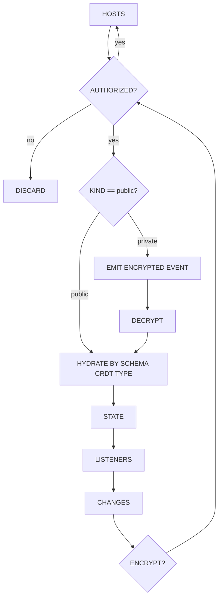

```ts
import {
  CRMapAck,
  CRMapSnapshot,
} from '@sovereignbase/convergent-replicated-map'
import { CRSetSnapshot } from '@sovereignbase/convergent-replicated-set'
import { CRStructSnapshot } from '@sovereignbase/convergent-replicated-struct'
import {
  CipherMessage,
  OpaqueIdentifier,
  VerifyKey,
} from '@sovereignbase/cryptosuite'
import type { SchemaCRDTSnapshot } from '@sovereignbase/schema-crdt'

type ConvergentReplicatedResourceClearanceSnapshot = CRStructSnapshot<{
  owner: CRMapSnapshot<OpaqueIdentifier, VerifyKey>
  manager: CRMapSnapshot<OpaqueIdentifier, VerifyKey>
  editor: CRMapSnapshot<OpaqueIdentifier, VerifyKey>
}>

type ConvergentReplicatedResourceSnapshotBase<
  Kind extends 'private' | 'public',
  Data,
> = CRStructSnapshot<{
  kind: Kind
  data: Data
  host: CRSetSnapshot<string>
  frontiers: CRMapSnapshot<OpaqueIdentifier, object>
  clearance: ConvergentReplicatedResourceClearanceSnapshot
  authorization: Base64URLString
}>

export type ConvergentReplicatedResourceSnapshotPrivate =
  ConvergentReplicatedResourceSnapshotBase<'private', CipherMessage>

export type ConvergentReplicatedResourceSnapshotPublic =
  ConvergentReplicatedResourceSnapshotBase<'public', SchemaCRDTSnapshot>

export type ConvergentReplicatedResourceSnapshot =
  | ConvergentReplicatedResourceSnapshotPrivate
  | ConvergentReplicatedResourceSnapshotPublic

export type RawConvergentReplicatedResourceType = {
  kind: string
  data: object
  host: object
  clearance: object
  authorization: string
}
```


